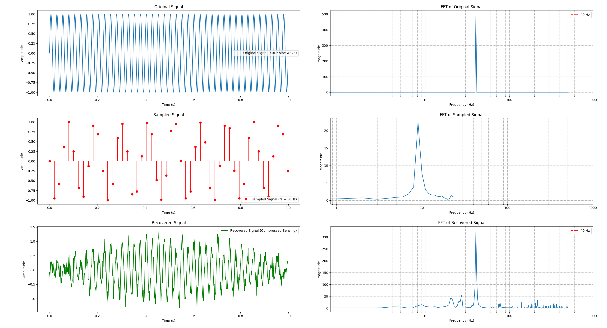

# Compressed Sensing Experiment

This repository demonstrates the application of **Compressed Sensing** to recover a signal from fewer samples than traditionally required. The project uses Python libraries like NumPy, SciPy, and scikit-learn for signal processing and recovery.

## Project Overview

Compressed sensing is a technique that allows for the recovery of sparse signals from a reduced number of measurements. This experiment focuses on:
1. Generating a sine wave signal.
2. Downsampling the signal to a lower sampling frequency.
3. Applying compressed sensing with a random Gaussian measurement matrix.
4. Recovering the signal using L1 minimization (Lasso).

## Results

Here are some visualizations comparing the original, sampled, and recovered signals:



## Files

- `compressed_sensing.py`: Main script for signal generation, downsampling, compressed sensing, and plotting results.
- `requirements.txt`: List of required Python packages.

## Installation

Clone the repository and install the required packages:

```bash
git clone https://github.com/yourusername/compressed-sensing.git
cd compressed-sensing
pip install -r requirements.txt
